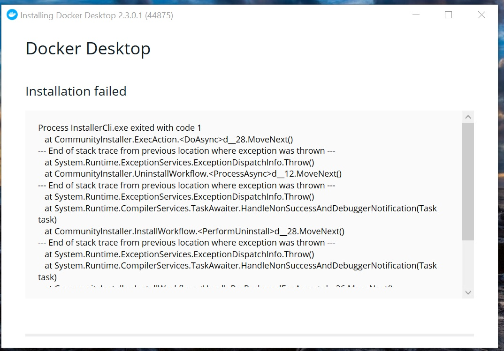
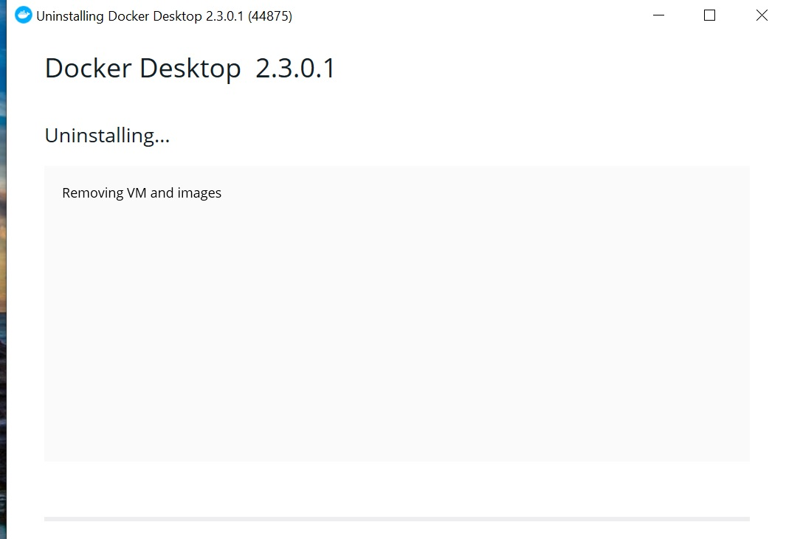

All right, I'm going to write a blog every month this year! But this is finally my second post of the year. 😴

Since I got Docker for win wsl2 backend, I've been living my life with Windows as if everything is OK.
However, I still get stuck on Windows sometimes.
This is an article on how to get back to Docker since I can't upgrade it at all anymore.

### Couldn't version up Docker
I failed to upgrade Docker. When I followed the instructions to upgrade, I got some error messages with the words "Installation failed".



I see. I don't understand.

The same error occurred no matter how many times I tried, and I couldn't understand it even after researching, so I gave up and decided to reinstall Docker.


### Couldn't uninstall Docker
When I reinstalled Docker, I first tried to uninstall it, but that also failed.

Uninstalling Docker Desktop from Settings > Apps & features resulted in



It was fine until I got to the above screen, but from here on, no matter how long I waited, it never changed from Uninstalling.... But from this point on, I waited and waited, but nothing changed.

### Solved: Kill Docker.service
The problem of perpetual waiting for Uninstalling was reported in Issue.

https://github.com/docker/for-win/issues/7489


According to the comments, I was told to terminate Docker.service in Task Manager.


After the end task was executed, docker was no longer accessible from wsl2.

```sh
$ docker ps
Cannot connect to the Docker daemon at unix:///var/run/docker.sock. Is the docker daemon running?
```

### Could uninstalled Docker
Kill Docker.service and Uninstall Docker Desktop from Settings > App & fatures again.


This time, it uninstalled without a hitch!
Virtual Box left some mysterious virtual interface garbage behind, but Docker seems to have uninstalled cleanly. 🤗

After uninstalling, I reinstalled Docker again from the Docker for win installer and I'm done. Thanks for your help.
