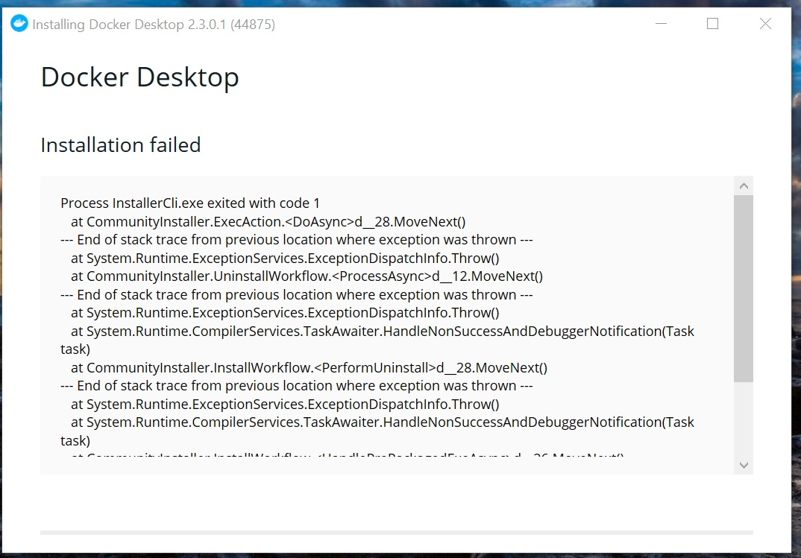
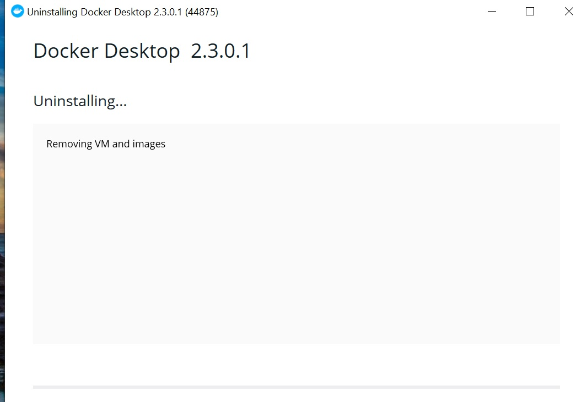
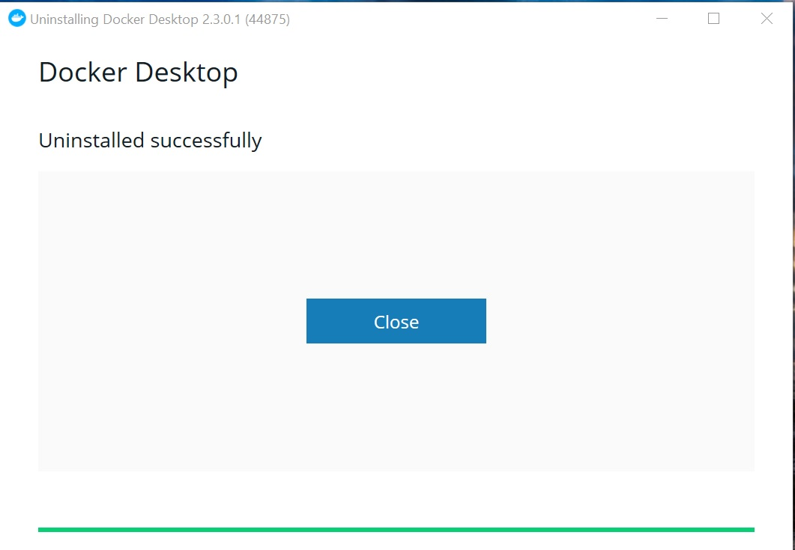

よーし今年は毎月blog書くぞ！と意気込んでいましたが、これ本年ようやく2回目の記事です。😴

さてDocker for win wsl2 backendを得てからというもの、もはやWindowsで万事OKといった生活を送っていました。
が、しかし、やはりたまにド嵌りする所がWindowsですね。
Dockerのアップデートに失敗し、一向にバージョンアップできなくなったので、その復帰方法についての記事です。

### Dockerアップデートできない
Dockerのアップデートに失敗しました。アップデートの案内が出たので、指示に従って実施したところ、"Installation failed" の文字と共に何やらエラーメッセージが、、



なるほど、わからん。

何度やっても同じエラーが発生し、調べても良くわからないので、諦めてDockerを再インストールすることにしました。


### Dockerアンインストールできない
Dockerの再インストールにあたって、まずはアンインストールしようとしたところ、これも失敗しました。

Settings > Apps & featuresから、Docker DesktopをUninstallすると、



上記の画面になるまではよかったのですが、ここから待てど暮らせどUninstalling...から変わりませんでした。

### 解決法: Docker.serviceを終了する
永久にUninstallingで待ち続ける問題は、Issueに報告があがっていました。

https://github.com/docker/for-win/issues/7489


コメントによると、タスクマネージャでDocker.serviceを終了させろとのことでした。


End task実施後は、wsl2からもdockerにアクセスできなくなっていました。

```sh
$ docker ps
Cannot connect to the Docker daemon at unix:///var/run/docker.sock. Is the docker daemon running?
```

### Dockerアンインストールできた
Docker.serviceを終了させ、再度Settings > App & faturesからDocker DesktopのUninstallを実施。



今度は無事にアンインストールできました！
Virtual Boxでは、謎の仮想インタフェースのゴミが残ってしまったりしましたが、Dockerは綺麗さっぱりアンインストールできたように見えます。🤗

アンインストールできたところで、再度Docker for winのインストーラから再インストールして完了です。お疲れさまでした。
