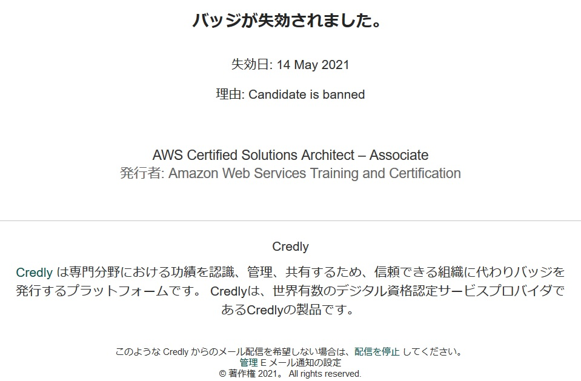
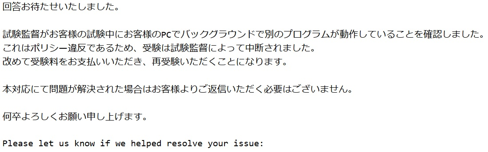
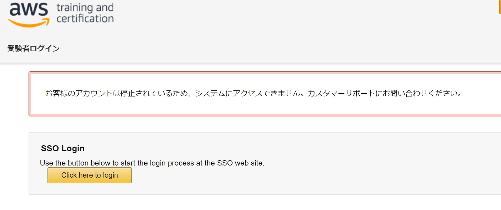
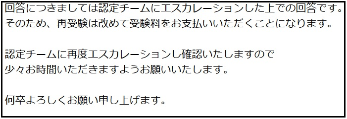
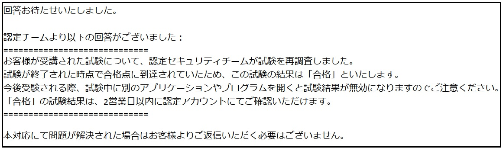

I took the SAP (Solutions Architect Professional) exam because my AWS SAA certification was about to expire. As online is the norm nowadays, I took the AWS certification exam online at PSI-Online, as it is possible to take the exam from home.

Although I passed the exam, I was disqualified once due to an inadequate environment, and then passed after repeated inquiries. I would like to write about my struggle in the hope that it will be helpful to others.

Translated with www.DeepL.com/Translator (free version)

## I took the exam online
I took the exam online because I was in the middle of a pandemic, and I could choose between PSI-Online and Pearson VUE for the AWS certification exam. I chose to take the exam through PSI-Online.

### Check the software beforehand
To take the exam at PSI-Online, you need to install a special software.

About 30 minutes before the exam, I installed the software on Windows and when I tried to connect to the exam, Hyper-V and other background processes were running and I could not start the exam. I switched to a mac in a hurry and took the exam, but I missed the start time by about 10 minutes.

It was the first time I took the exam, and I was in a great hurry. I think it's better to install and check the startup as soon as possible in order to take the exam calmly.

### Notification of forced disconnection, disqualification, and SAA revocation
Four minutes before the end of the exam, I had finished solving all the questions and was reviewing the ones I had marked with a check mark, when the incident happened.

Suddenly the words **VIOLATION** appeared on the screen, and the software force-quit, as if I had pressed ALT+F4. I couldn't figure out what was going on, so I tried to reconnect, but the screen said the exam was over and I couldn't connect.

At a loss, I contacted AWS support and called it a day. Later, I received the following email from Credly, which issues badges for AWS certification.

Translated with www.DeepL.com/Translator (free version)



AWS support also responded.




I was disqualified from the SAP exam because it appeared that cheating had taken place. In addition, my certified **SAA certification was revoked**.



Are you kidding?

### Struggling with Support
I was not satisfied, so I contacted support, but it was a long process and took about a month to resolve. It took about a month to solve the problem. The inquiry went back and forth from AWS -> PSI -> AWS -> PSI -> and so on. Each company has their own issue tracker, and we had to explain the same thing to each one.

PSI almost always came back with nothing but **ask AWS** templates.

```

Please click the link below to contact AWS directly.

AWS Link: https://aws.amazon.com/contact-us/?nc1=h_ls

```

After all, it seems that PSI-Online is only doing the test on behalf of the company, and there is nothing they can do about the results they have produced.
I continued to patiently ask AWS support for confirmation.

I told them that I could not accept the deprivation of the SAA because I had not committed any fraud.



Oh, I see..

### Suddenly passing SAP
I kept communicating with AWS support, and suddenly I received a SAP acceptance notice. I was also able to log in to AWS training and was treated as recertified for SAA.



First of all, I was surprised because I had thought it would be a blessing if I could confirm that I had not cheated and withdraw my SAA revocation. Rather than being happy to have passed the exam, I was happy to finally be free from the hassle. I don't know if I've ever had an acceptance letter that made me this excited.

However, from start to finish, the AWS certified support was looking at me from the top. I don't think I'll ever take another AWS certification exam again, even if I don't have to worry about it. I'm tired.

## Extra: How to learn SAP
As an added bonus, I used the following to study. E-learning in particular is a must listen. I use AWS in my practice, but I focused on the issues of migrating from on-premise environment to AWS, and on-premise and AWS hybrid environment, as I had no experience with those issues.

- Official E-learning: https://www.aws.training/Details/eLearning?id=42403
- Problem collection (paid)(Ja): https://www.udemy.com/course/aws-53225/
- Official practice exams (Free coupons were given out when I passed the SAA. The exam was also half price with the coupon)

I recommend taking the exam in your native language because at first glance, all of the questions are difficult to answer correctly, but I think it is better to check the English as well because there are rather many mistranslations. In the worst cases, the service name was wrong (CloudFront in Japanese, CloudFormation in English, etc.)
