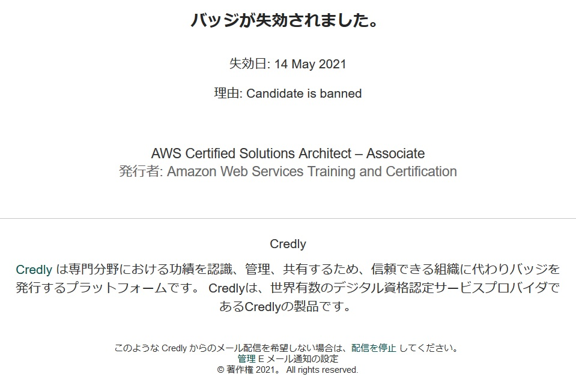
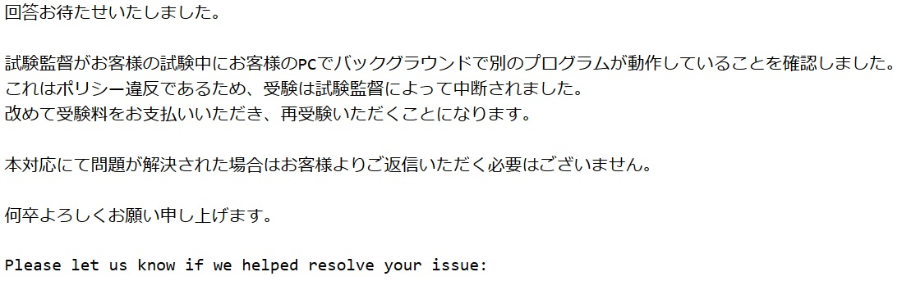
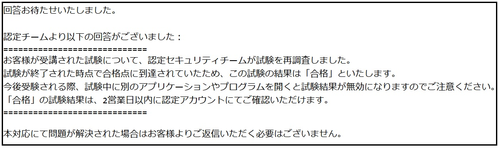

AWS認定のSAAの有効期限が切れそうだったので、SAP (Solutions Architect Professional)を受験しました。オンラインがあたりまえとなった昨今、AWS認定試験も自宅から受験可能ということで、PSI-Onlineにてオンライン受験しました。

結果は合格しましたが、環境不備により一度失格になった後、問い合わせを繰り返し合格、というなんとも気持ちの晴れない合格。後続の参考になればと思い、格闘を綴ります。

## オンライン受験した
パンデミック中ということでオンライン受験しました。AWS認定試験でのオンライン受験は、PSI-OnlineとPearson VUEのどちらかを選択できます。Pearson VUEは、サポートが日本語で受けられるものの、選択できる時間帯が少なかったため、私はPSI-Onlineでの受験を選択しました。

### ソフトウェアのチェックは事前に
PSI-Onlineでの受験は専用のソフトウェアをインストールして実施となります。

試験30分前あたりにWindowsにインストールし、試験に接続しようとしたろころ、Hyper-V等のバックグラウンドプロセスが起動しており、試験開始できず。急遽macに切り替えて受験しましたが、開始時間を10分程度過ぎてしまいました。

中々に初見殺しで、めちゃくちゃ焦りました。落ち着いて試験に挑むためにも、インストールと起動確認はできるだけ早くした方が良いと思います。

### 強制切断と失格、SAA剥奪の通知
試験終了4分前、全ての問題を解き終わり、チェックマークをつけた問題を見直していたところ、事件は起こりました。

画面に突然**VIOLATION**の文字、ソフトウェアはALT+F4を押したときのように、強制終了。何がなんだか分からなったので、再接続を試みましたが、試験は終了したとの旨が表示されており、接続できませんでした。

途方に暮れ、AWSサポートに問い合わせてその日は終了。後日AWS認定のバッジを発行しているCredlyより、以下のメールが届きました。



AWSサポートからも回答がきました。




SAPの試験で不正が行われたと見なされたようで、失格となりました。さらに認定済みであった**SAAの資格が剥奪**されました。

さらに、AWS trainingのアカウントも停止されていました。


嘘でしょ？

### サポートとの格闘
流石に納得がいかなかったので、サポートに問い合わせましたが、そこからが長く、結局解決まで約１か月かかりました。問い合わせはAWS -> PSI -> AWS -> PSI -> と、何度も何度もたらい回し。イシュートラッカーも各社それぞれあり、同じことをそれぞれ説明する必要がありました。

PSIは、ほぼほぼ**AWSに聞け**のテンプレしか返ってこなかったです。

```

下記リンクより直接AWSへのお問い合わせをお願い申し上げます。

AWSリンク: https://aws.amazon.com/jp/contact-us/?nc1=h_ls

```

結局のところ、PSI-Onlineは試験を代行してるに過ぎず、出してしまった結果に関しては何もできないようです。
AWSのサポートに根気強く確認依頼を続けました。

不正行為は実施していないので、SAA剥奪は承服しかねる旨伝えたところ、


あっ、そうなんですか。。

### 突然のSAP合格
AWSサポートとやりとりを続けていたところ、突然SAPの合格通知を頂きました。またAWS trainingにログインできるようになり、SAAについても再認定扱いになりました。



まずこちらとしては、不正をしてない事を確認し、SAA剥奪の撤回ができれば御の字くらいに考えていたので驚きました。合格してうれしいよりも、漸く面倒から解放されてうれしい気持ちが強かったです。いまだかつてこんなにテンションのあがらない合格通知があっただろうか、いやない。

しかし、終始AWS認定のサポートは上から目線でした。心配していただかなくとも、AWS認定試験はもう二度と受けないと思います。疲れた。

## おまけ: SAPの学習方法
おまけですが、学習は下記を使って勉強しました。特にE-learningは必聴です。私は実務でAWSを使っているのですが、オンプレ環境からAWSの移行の問題や、オンプレとAWSハイブリッド環境での問題は経験が無かったので重点的に行いました。

- 公式のE-learning: https://www.aws.training/Details/eLearning?id=42403
- 問題集(有料): https://www.udemy.com/course/aws-53225/
- 公式練習問題(SAAの合格時に無料クーポンが配布されていました。試験もクーポンで半額でした)

一見どれも正解の際どい問題が出るため、母語での受験をおすすめしますが、わりと誤訳があるため、英語も確認するようにしたほうが良いと思います。酷いものだとサービス名を間違えていました(日本語ではCloudFront、英語ではCloudFormationと書いてあった等)。
